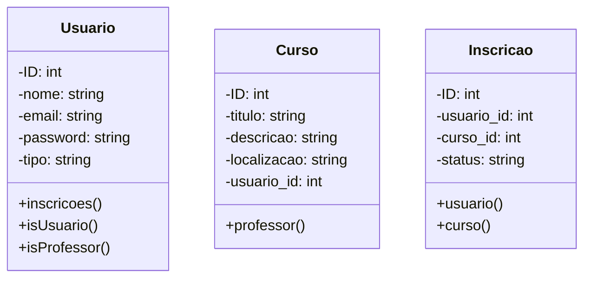
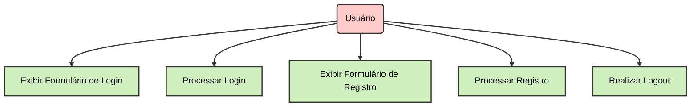
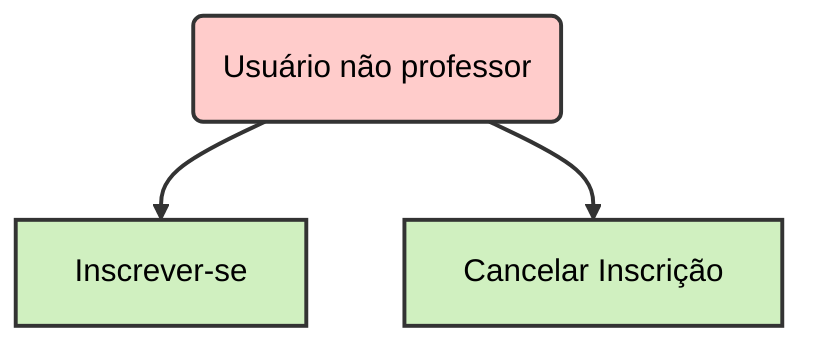
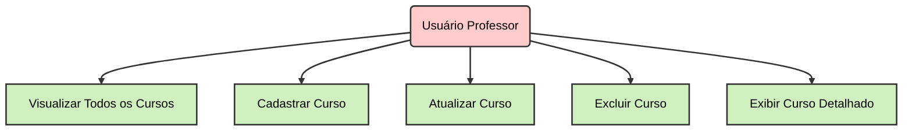
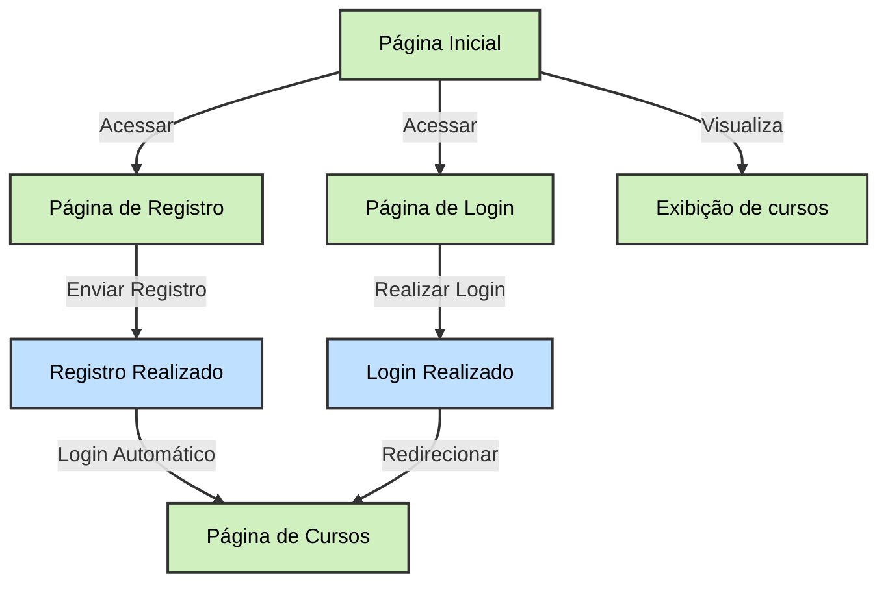
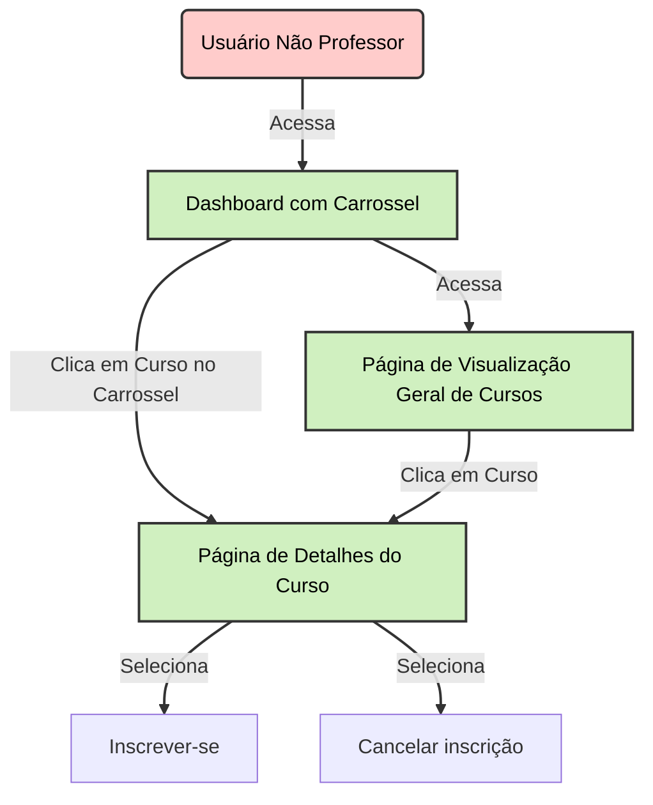
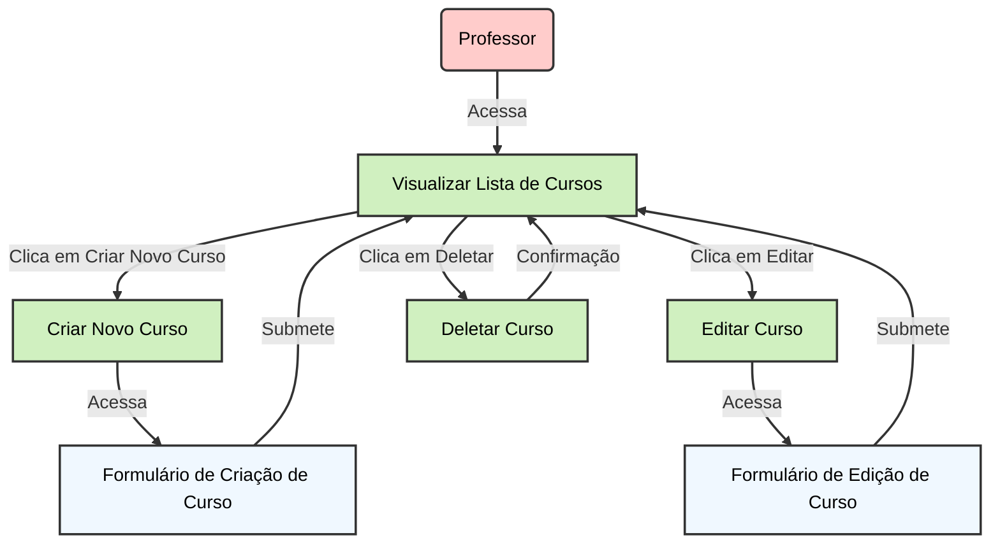

# Plataforma de Ensino à Distância

## Escopo

Desenvolver uma plataforma web interativa para cursos online, destinada a professores e alunos. A plataforma permitirá a criação e gerenciamento de cursos, matrícula de alunos, visualização de aulas e realização de atividades. Será desenvolvida utilizando o Laravel Framework para o back-end e PostgreSQL para o banco de dados.

**Funcionalidades Principais:**

1. **CRUD de Cursos:**
    - **Criar:** Professores podem criar novos cursos com título, descrição e categorização.
    - **Ler:** Visualização de cursos ativos e suas informações detalhadas.
    - **Atualizar:** Edição das informações dos cursos.
    - **Deletar:** Remoção de cursos não desejados.
2. **Sistema de Autenticação:**
    - **Cadastro e Login:** Professores e alunos podem se registrar e acessar a plataforma.
    - **Gestão de Perfil:** Usuários podem atualizar suas informações pessoais e de contato.
3. **Gestão de Conteúdo:**
    - **Aulas:** Upload e gerenciamento de materiais de aula, vídeos e documentos.
    - **Atividades:** Criação e acompanhamento de tarefas e avaliações.
4. **Inscrição em Cursos:**
    - **Matrícula:** Alunos podem se inscrever em cursos disponíveis.
    - **Acompanhamento:** Alunos podem visualizar o progresso e realizar atividades.

## Objetivos

1. Implementar um CRUD completo para cursos.
2. Desenvolver um sistema de autenticação robusto para professores e alunos.
3. Permitir que alunos se inscrevam em cursos e acompanhem seu progresso.
4. Facilitar a criação e gerenciamento de cursos pelos professores.

## Cronograma

1. **Análise de Requisitos e Definição do Escopo (Semana 1-2):**
    - Reuniões com stakeholders para levantamento de requisitos.
    - Documentação e aprovação do escopo.
2. **Implementação do CRUD para Cursos (Semana 3-5):**
    - Desenvolvimento do modelo de dados.
    - Implementação das funcionalidades de criação, leitura, atualização e exclusão de cursos.
    - Testes iniciais e ajustes.
3. **Implementação do Sistema de Autenticação (Semana 6-7):**
    - Configuração de autenticação e autorização.
    - Desenvolvimento das funcionalidades de registro e login.
    - Implementação de gerenciamento de perfil.
4. **Gerenciamento de Conteúdo e Inscrição em Cursos (Semana 8-10):**
    - Implementação do upload e gerenciamento de conteúdos de aula.
    - Desenvolvimento do sistema de inscrição e acompanhamento de cursos.
    - Testes e ajustes.
5. **Documentação e Entrega (Semana 11-12):**
    - Preparação da documentação do usuário e técnica.
    - Revisões finais e preparação para a entrega.
    - Treinamento de usuários e suporte inicial.

## Recursos

- **Laravel Framework:** Para desenvolvimento de back-end e gestão de rotas.
- **PostgreSQL Database:** Para armazenamento de dados.
- **Bootstrap 5:** Para desenvolvimento da interface de usuário.
- **GitHub:** Para controle de versão e colaboração.

## Análise de Riscos

1. **Problemas com Disponibilização de Conteúdos:**
    - **Risco:** Dificuldades no upload e gerenciamento de arquivos.
    - **Mitigação:** Implementar validações e testes rigorosos de upload. Fornecer suporte técnico e instruções claras aos usuários.
2. **Desafios na Implementação da Interface de Usuário:**
    - **Risco:** Interface pouco intuitiva e difícil de usar.
    - **Mitigação:** Realizar testes de usabilidade com usuários finais. Ajustar o design com base no feedback.
3. **Segurança de Dados e Controle de Acesso:**
    - **Risco:** Acesso não autorizado e vazamento de dados.
    - **Mitigação:** Implementar criptografia para dados sensíveis e controle rigoroso de permissões. Realizar auditorias de segurança regulares.
4. **Problemas de Performance e Escalabilidade:**
    - **Risco:** A plataforma pode não suportar um grande número de usuários simultâneos.
    - **Mitigação:** Realizar testes de carga e otimizar consultas ao banco de dados. Planejar e implementar soluções de escalabilidade.

# Diagramas de classe:

# Diagramas de uso:
## 1. Usuario

## 2. Inscrição

## 3. Curso

# Diagramas de fluxo
## Usuário não logado

## Usuário não professor gerenciando inscrição de cursos

## Usuário professor gerenciando seus cursos

