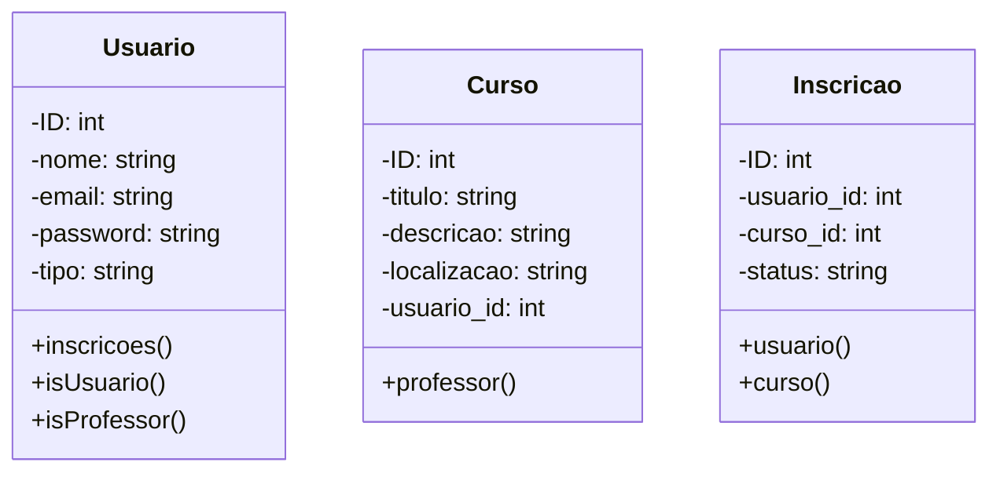
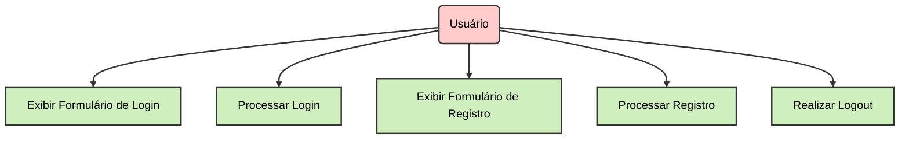
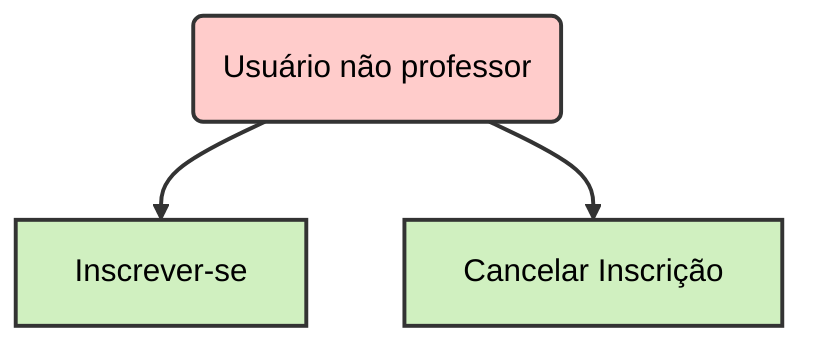
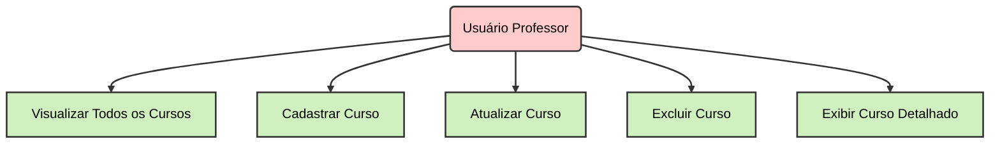
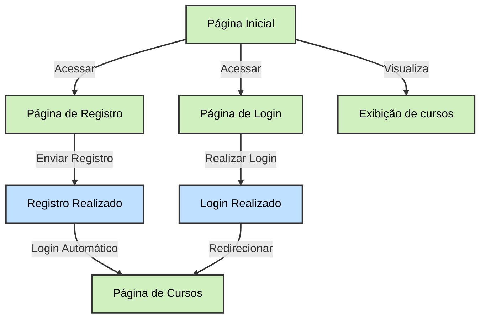
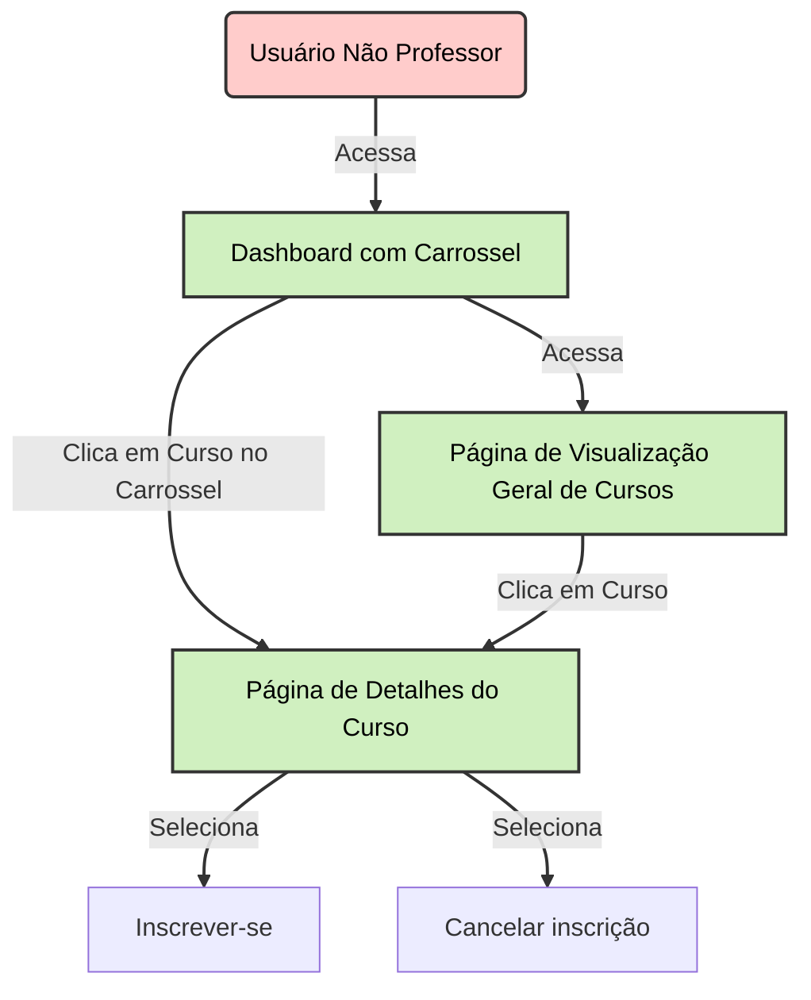
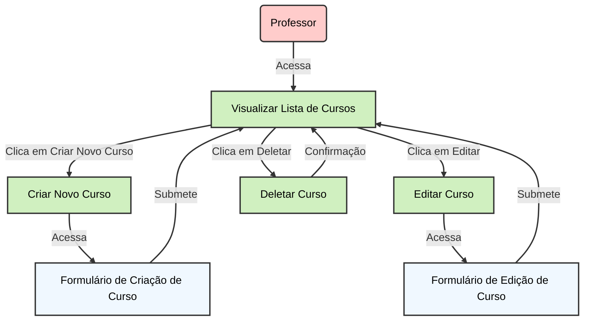

# Plataforma de Ensino à Distância

## Escopo

Desenvolver uma plataforma web interativa para cursos online, destinada a professores e alunos. A plataforma permitirá a criação e gerenciamento de cursos, matrícula de alunos, visualização de aulas e realização de atividades. Será desenvolvida utilizando o Laravel Framework para o back-end e PostgreSQL para o banco de dados.

**Funcionalidades Principais:**

1. **CRUD de Cursos:**
    - **Criar:** Professores podem criar novos cursos com título, descrição e categorização.
    - **Ler:** Visualização de cursos ativos e suas informações detalhadas.
    - **Atualizar:** Edição das informações dos cursos.
    - **Deletar:** Remoção de cursos não desejados.
2. **Sistema de Autenticação:**
    - **Cadastro e Login:** Professores e alunos podem se registrar e acessar a plataforma.
    - **Gestão de Perfil:** Usuários podem atualizar suas informações pessoais e de contato.
3. **Gestão de Conteúdo:**
    - **Aulas:** Upload e gerenciamento de materiais de aula, vídeos e documentos.
    - **Atividades:** Criação e acompanhamento de tarefas e avaliações.
4. **Inscrição em Cursos:**
    - **Matrícula:** Alunos podem se inscrever em cursos disponíveis.
    - **Acompanhamento:** Alunos podem visualizar o progresso e realizar atividades.

## Objetivos

### Objetivo 1: Implementar um CRUD completo para cursos

- **Específico:** Desenvolver uma aplicação web para gerenciar cursos.
- **Mensurável:** Incluir funcionalidades para criar, ler, atualizar e deletar cursos.
- **Alcançável:** Utilizar tecnologias apropriadas para frontend (Laravel) e backend (PostgreSQL).

### Objetivo 2: Desenvolver um sistema de autenticação robusto para professores e alunos

- **Específico:** Implementar um sistema seguro de login e logout.
- **Mensurável:** Incluir cadastro, login, logout e gerenciamento de senhas.
- **Alcançável:** Usar bibliotecas de autenticação e seguir melhores práticas de segurança.

### Objetivo 3: Permitir que alunos se inscrevam em cursos.

- **Específico:** Desenvolver funcionalidades para inscrição.
- **Mensurável:** Incluir inscrição em cursos.
- **Alcançável:** Criar interfaces e conectar com o backend para gestão de dados.

### Objetivo 4: Facilitar a criação e gerenciamento de cursos pelos professores

- **Específico:** Criar uma interface para que professores gerenciem seus cursos.
- **Alcançável:** Desenvolver uma interface intuitiva e funcional.

## Cronograma

1. **Análise de Requisitos e Definição do Escopo (Semana 1-2):**
    - Reuniões com stakeholders para levantamento de requisitos.
    - Documentação e aprovação do escopo.
2. **Implementação do CRUD para Cursos (Semana 3-5):**
    - Desenvolvimento do modelo de dados.
    - Implementação das funcionalidades de criação, leitura, atualização e exclusão de cursos.
    - Testes iniciais e ajustes.
3. **Implementação do Sistema de Autenticação (Semana 6-7):**
    - Configuração de autenticação e autorização.
    - Desenvolvimento das funcionalidades de registro e login.
    - Implementação de gerenciamento de perfil.
4. **Gerenciamento de Conteúdo e Inscrição em Cursos (Semana 8-10):**
    - Implementação do upload e gerenciamento de conteúdos de aula.
    - Desenvolvimento do sistema de inscrição e acompanhamento de cursos.
    - Testes e ajustes.
5. **Documentação e Entrega (Semana 11-12):**
    - Preparação da documentação do usuário e técnica.
    - Revisões finais e preparação para a entrega.
    - Treinamento de usuários e suporte inicial.

## Recursos Necessários

### Tecnológicos

- **Laravel Framework**
  - **Descrição:** Framework PHP para desenvolvimento de back-end. Facilita a criação de APIs, gestão de rotas, e implementações de funcionalidades complexas.
  - **Função:** Gerenciar a lógica de negócios e interações com o banco de dados, além de proporcionar uma estrutura organizada para o desenvolvimento.

- **PostgreSQL Database**
  - **Descrição:** Sistema de gerenciamento de banco de dados relacional. Oferece robustez, escalabilidade e suporte a transações complexas.
  - **Função:** Armazenar e gerenciar dados sobre cursos, usuários, inscrições e progresso dos alunos.

- **Bootstrap 5**
  - **Descrição:** Framework CSS para desenvolvimento de front-end responsivo. Fornece componentes e estilos pré-definidos.
  - **Função:** Desenvolver a interface de usuário de maneira consistente e responsiva, melhorando a experiência do usuário em diferentes dispositivos.

- **GitHub**
  - **Descrição:** Plataforma de controle de versão baseada em Git. Facilita o gerenciamento de código-fonte e colaboração entre equipes.
  - **Função:** Gerenciar o controle de versão do código, facilitar o trabalho colaborativo e realizar revisões de código.

### Recursos Humanos

- **Desenvolvedor Back-end**
  - **Descrição:** Profissional responsável pelo desenvolvimento da lógica de servidor, integração com o banco de dados e implementação das funcionalidades de back-end.
  - **Habilidades Necessárias:** Experiência com Laravel Framework e PostgreSQL, conhecimento em APIs RESTful e segurança de aplicações.

- **Desenvolvedor Front-end**
  - **Descrição:** Profissional responsável pelo desenvolvimento da interface de usuário, garantindo que a aplicação seja visualmente atraente e funcional.
  - **Habilidades Necessárias:** Experiência com Bootstrap 5, HTML, CSS, JavaScript, e frameworks modernos como React ou Vue.js pode ser um diferencial.

- **Designer UI/UX**
  - **Descrição:** Profissional que cria a interface visual da aplicação e assegura uma experiência de usuário intuitiva e agradável.
  - **Habilidades Necessárias:** Experiência em design de interfaces e usabilidade, familiaridade com ferramentas de design como Figma ou Adobe XD.

- **Especialista em Segurança (para sistemas sensíveis)**
  - **Descrição:** Profissional responsável por garantir a segurança dos dados e proteger a aplicação contra vulnerabilidades e ataques.
  - **Habilidades Necessárias:** Conhecimento em práticas de segurança, como criptografia, gestão de sessões, e proteção contra ataques comuns (e.g., SQL Injection, XSS).

### Outros Recursos

- **Documentação e Comunicação**
  - **Descrição:** Ferramentas e práticas para garantir uma documentação clara e comunicação eficaz dentro da equipe.
  - **Ferramentas Sugeridas:** Confluence ou Google Docs para documentação, Slack ou Microsoft Teams para comunicação.

- **Ambiente de Desenvolvimento e Testes**
  - **Descrição:** Infraestrutura para desenvolvimento e testes contínuos.
  - **Ferramentas Sugeridas:** Docker para ambientes de desenvolvimento consistentes, Jenkins ou GitHub Actions para integração contínua e testes automatizados.

- **Serviços de Hospedagem**
  - **Descrição:** Infraestrutura para hospedar a aplicação em produção.
  - **Opções Sugeridas:** Heroku, AWS, ou DigitalOcean, dependendo das necessidades de escalabilidade e orçamento.

## Análise de Riscos

1. **Problemas com Disponibilização de Conteúdos:**
    - **Risco:** Dificuldades no upload e gerenciamento de arquivos.
    - **Mitigação:** Implementar validações e testes rigorosos de upload. Fornecer suporte técnico e instruções claras aos usuários.
2. **Desafios na Implementação da Interface de Usuário:**
    - **Risco:** Interface pouco intuitiva e difícil de usar.
    - **Mitigação:** Realizar testes de usabilidade com usuários finais. Ajustar o design com base no feedback.
3. **Segurança de Dados e Controle de Acesso:**
    - **Risco:** Acesso não autorizado e vazamento de dados.
    - **Mitigação:** Implementar criptografia para dados sensíveis e controle rigoroso de permissões. Realizar auditorias de segurança regulares.
4. **Problemas de Performance e Escalabilidade:**
    - **Risco:** A plataforma pode não suportar um grande número de usuários simultâneos.
    - **Mitigação:** Realizar testes de carga e otimizar consultas ao banco de dados. Planejar e implementar soluções de escalabilidade.

# Diagramas de classe:

# Diagramas de uso:
## 1. Usuario

## 2. Inscrição

## 3. Curso

# Diagramas de fluxo
## Usuário não logado

## Usuário não professor gerenciando inscrição de cursos

## Usuário professor gerenciando seus cursos

# Manual do Usuário

Este guia abrange as principais funcionalidades disponíveis em nossa plataforma. Siga as instruções abaixo para navegar e utilizar eficientemente o sistema.

---

## 1. Usuário Não Logado

### **Objetivo:**
Permitir que usuários não logados acessem a página inicial, realizem o registro ou o login, e visualizem os cursos disponíveis.

### **Fluxo de Navegação:**

1. **Página Inicial:**
   - Ao acessar o sistema pela primeira vez, você será direcionado para a **Página Inicial**.

2. **Visualizar Cursos:**
   - Na **Página Inicial**, você pode visualizar os cursos disponíveis clicando no link para **Exibição de Cursos**.

3. **Registro:**
   - Para se registrar, acesse a **Página de Registro** a partir da **Página Inicial**.
   - Preencha o formulário de registro e envie as informações. Após o registro bem-sucedido, você será automaticamente direcionado para a **Página de Cursos**.

4. **Login:**
   - Caso já possua uma conta, acesse a **Página de Login** a partir da **Página Inicial**.
   - Insira suas credenciais e, ao realizar o login com sucesso, você será redirecionado para a **Página de Cursos**.

---

## 2. Usuário Não Professor Gerenciando Inscrições de Cursos

### **Objetivo:**
Permitir que usuários não professores visualizem, inscrevam-se ou cancelem inscrições em cursos.

### **Fluxo de Navegação:**

1. **Dashboard com Carrossel:**
   - Ao fazer login, você será direcionado para o **Dashboard com Carrossel**.

2. **Visualizar Cursos:**
   - A partir do **Dashboard com Carrossel**, você pode acessar a **Página de Visualização Geral de Cursos** ou clicar diretamente em um curso no carrossel para ir para a **Página de Detalhes do Curso**.

3. **Detalhes do Curso:**
   - Na **Página de Detalhes do Curso**, você pode optar por **Inscrever-se** no curso ou **Cancelar Inscrição** se já estiver inscrito.

---

## 3. Usuário Professor Gerenciando Seus Cursos

### **Objetivo:**
Permitir que professores visualizem, criem, editem e excluam seus cursos.

### **Fluxo de Navegação:**

1. **Visualizar Lista de Cursos:**
   - Ao fazer login como professor, você será direcionado para a **Página de Visualização de Lista de Cursos**.

2. **Criar Novo Curso:**
   - Na lista de cursos, você pode clicar em **Criar Novo Curso** para acessar o **Formulário de Criação de Curso**. Preencha o formulário e submeta para adicionar um novo curso à lista.

3. **Editar Curso:**
   - Para editar um curso existente, clique em **Editar** ao lado do curso desejado e acesse o **Formulário de Edição de Curso**. Faça as alterações necessárias e submeta o formulário para atualizar o curso.

4. **Deletar Curso:**
   - Se precisar excluir um curso, clique em **Deletar** e confirme a ação na página de confirmação. O curso será removido da lista.

### **Observação Importante:**
Os professores são adicionados ao sistema manualmente. Caso você precise de acesso como professor e ainda não tenha sido cadastrado, entre em contato com o administrador do sistema para solicitar a inclusão.
