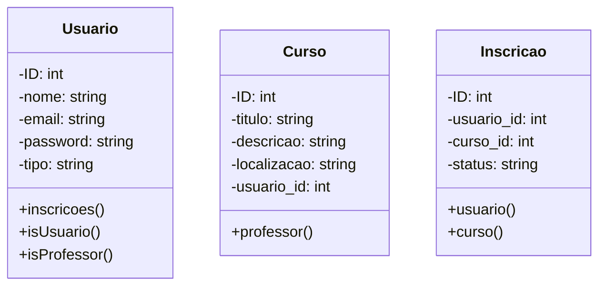
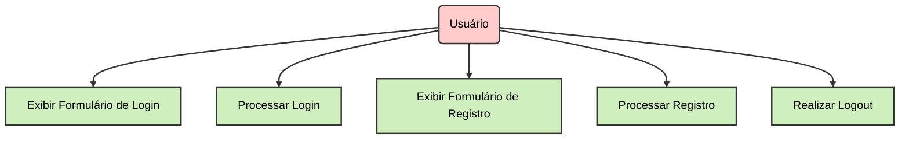
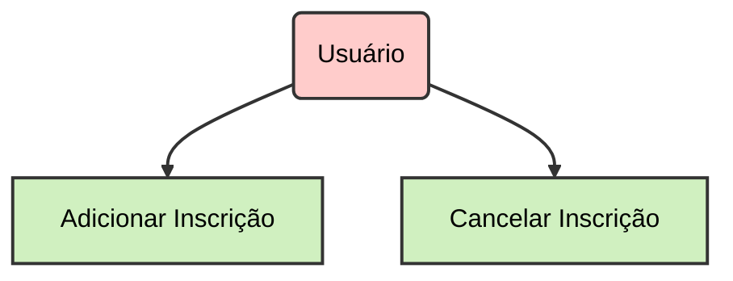
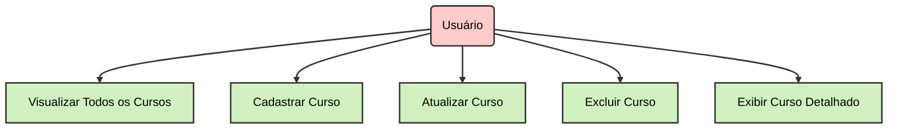
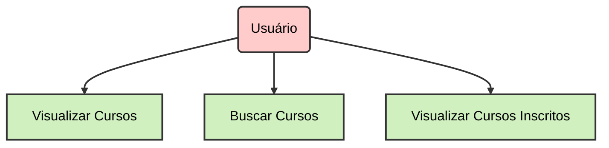

# Diagramas de classe:

```mermaid
classDiagram
    class Usuario {
        -ID: int
        -nome: string
        -email: string
        -password: string
        -tipo: string
        +inscricoes()
        +isUsuario()
        +isProfessor()
    }

    class Curso {
        -ID: int
        -titulo: string
        -descricao: string
        -localizacao: string
        -usuario_id: int
        +professor()
    }

    class Inscricao {
        -ID: int
        -usuario_id: int
        -curso_id: int
        -status: string
        +usuario()
        +curso()
    }
```

# Diagramas de uso:
## 1. Usuario

```mermaid
flowchart TD
    %% Definindo o Ator
    A1(Usuário)

    %% Definindo os Casos de Uso
    C1[Exibir Formulário de Login]
    C2[Processar Login]
    C3[Exibir Formulário de Registro]
    C4[Processar Registro]
    C5[Realizar Logout]

    %% Relacionamentos
    A1 --> C1
    A1 --> C2
    A1 --> C3
    A1 --> C4
    A1 --> C5

    %% Estilizando o Ator
    classDef actor fill:#ffcccb,stroke:#333,stroke-width:2px,color:#000;
    class A1 actor;
    
    %% Estilizando os Casos de Uso
    classDef usecase fill:#d0f0c0,stroke:#333,stroke-width:2px,color:#000;
    class C1,C2,C3,C4,C5 usecase;

    %% Estilizando as Conexões
    linkStyle default stroke:#333,stroke-width:2px;
```
## 2. Inscrição

```mermaid
flowchart TD
    %% Definindo o Ator
    A2(Usuário)

    %% Definindo os Casos de Uso
    C1[Adicionar Inscrição]
    C2[Cancelar Inscrição]

    %% Relacionamentos
    A2 --> C1
    A2 --> C2

    %% Estilizando o Ator
    classDef actor fill:#ffcccb,stroke:#333,stroke-width:2px,color:#000;
    class A2 actor;
    
    %% Estilizando os Casos de Uso
    classDef usecase fill:#d0f0c0,stroke:#333,stroke-width:2px,color:#000;
    class C1,C2 usecase;

    %% Estilizando as Conexões
    linkStyle default stroke:#333,stroke-width:2px;
```
## 3. Curso

```mermaid
flowchart TD
    %% Definindo o Ator
    A5(Usuário)

    %% Definindo os Casos de Uso
    C1[Visualizar Todos os Cursos]
    C2[Cadastrar Curso]
    C3[Atualizar Curso]
    C4[Excluir Curso]
    C5[Exibir Curso Detalhado]

    %% Relacionamentos
    A5 --> C1
    A5 --> C2
    A5 --> C3
    A5 --> C4
    A5 --> C5

    %% Estilizando o Ator
    classDef actor fill:#ffcccb,stroke:#333,stroke-width:2px,color:#000;
    class A5 actor;
    
    %% Estilizando os Casos de Uso
    classDef usecase fill:#d0f0c0,stroke:#333,stroke-width:2px,color:#000;
    class C1,C2,C3,C4,C5 usecase;

    %% Estilizando as Conexões
    linkStyle default stroke:#333,stroke-width:2px;
```
## 4. Dashboard

```mermaid
flowchart TD
    %% Definindo o Ator
    A4(Usuário)

    %% Definindo os Casos de Uso
    C1[Visualizar Cursos]
    C2[Buscar Cursos]
    C3[Visualizar Cursos Inscritos]

    %% Relacionamentos
    A4 --> C1
    A4 --> C2
    A4 --> C3

    %% Estilizando o Ator
    classDef actor fill:#ffcccb,stroke:#333,stroke-width:2px,color:#000;
    class A4 actor;
    
    %% Estilizando os Casos de Uso
    classDef usecase fill:#d0f0c0,stroke:#333,stroke-width:2px,color:#000;
    class C1,C2,C3 usecase;

    %% Estilizando as Conexões
    linkStyle default stroke:#333,stroke-width:2px;
```
