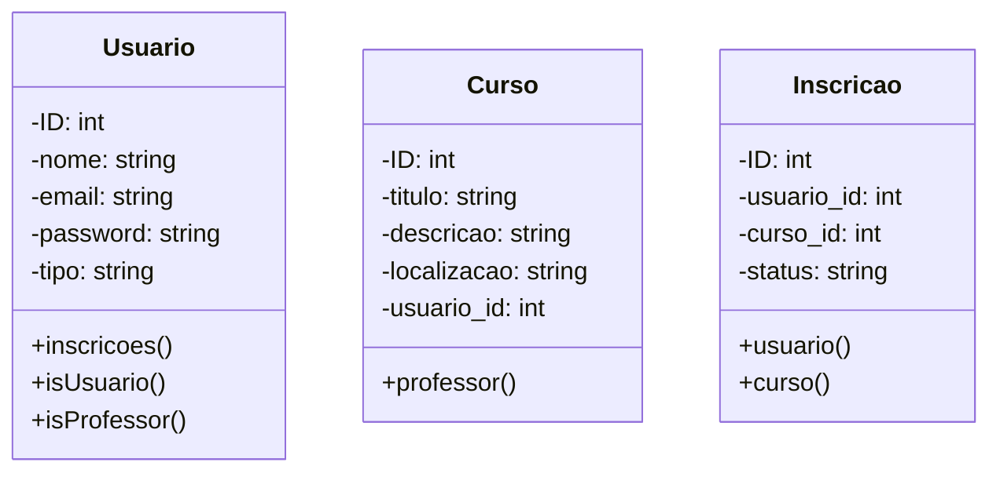
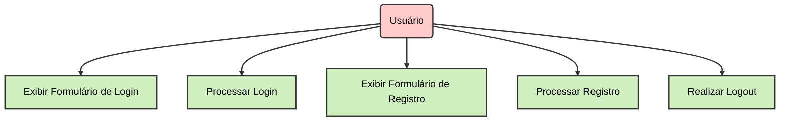
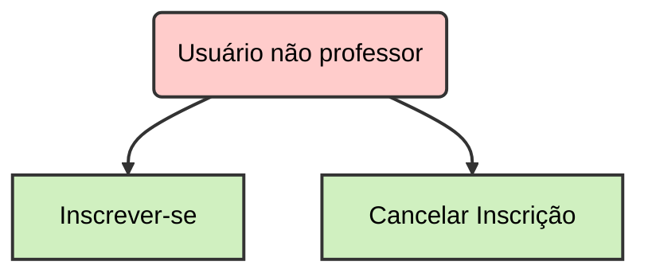
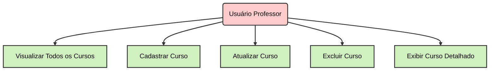
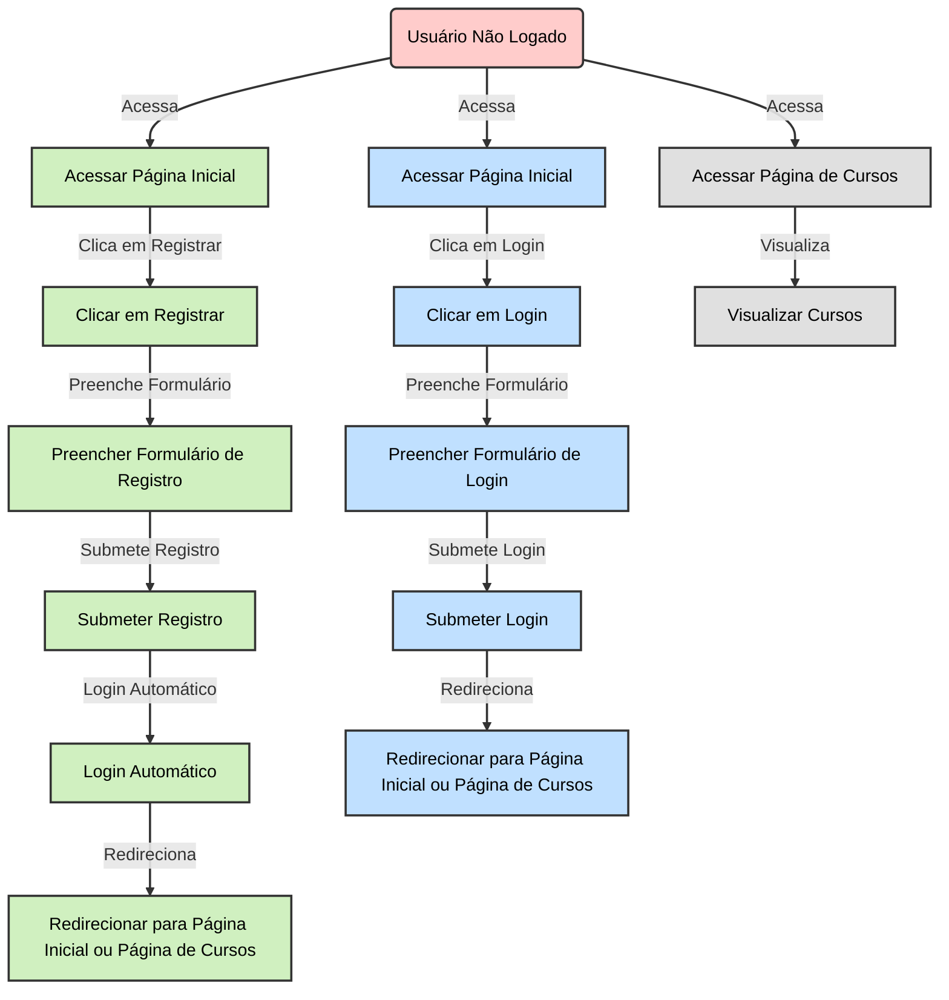
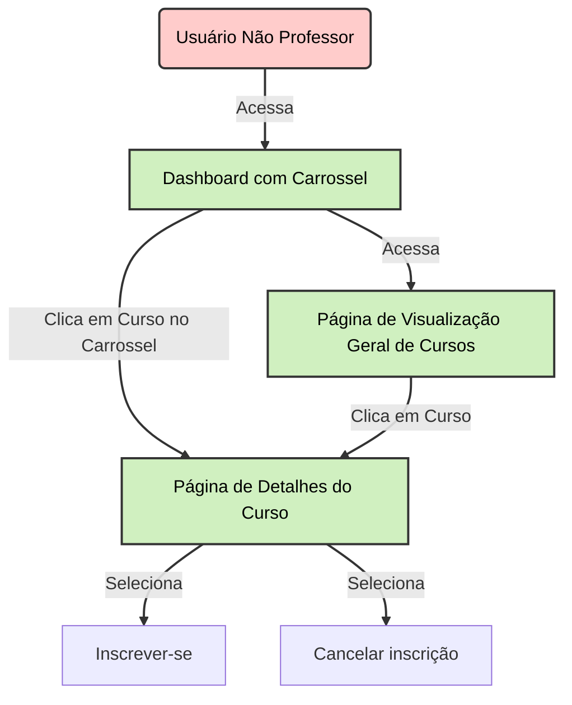
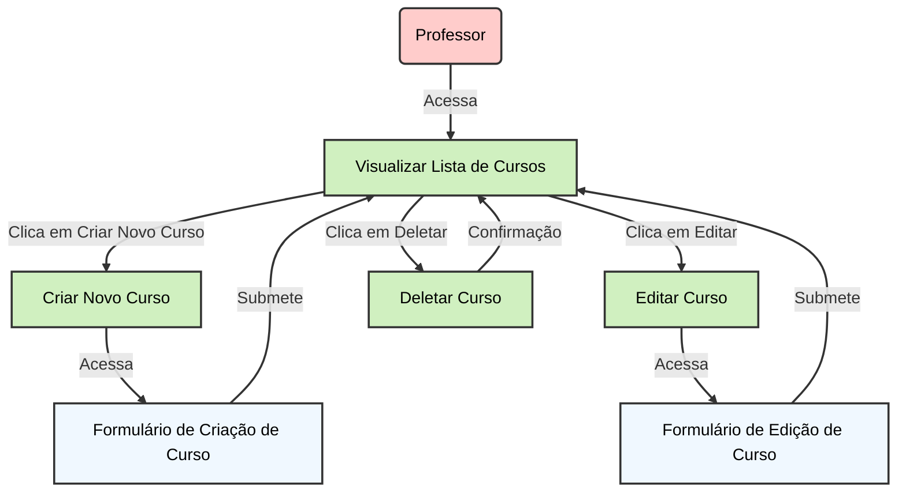

# Diagramas de classe:

# Diagramas de uso:
## 1. Usuario

## 2. Inscrição

## 3. Curso

# Diagramas de fluxo
## Usuário não logado

## Usuário não professor gerenciando inscrição de cursos

## Usuário professor gerenciando seus cursos

